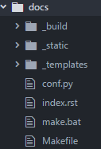
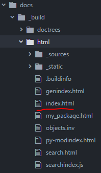
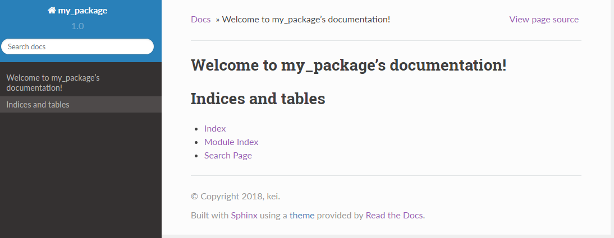
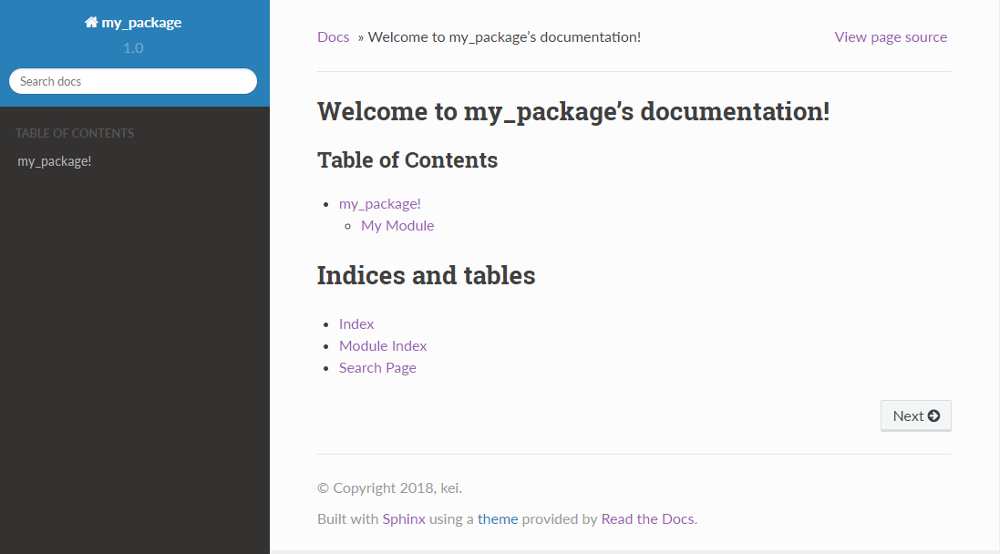
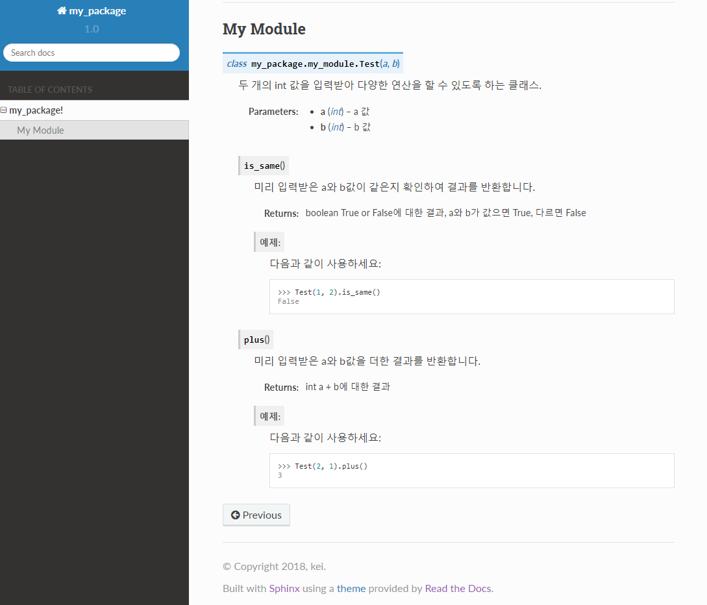

```sh
$ pip install Sphinx
```

빠른 시작을 위해 다음 명령어를 입력한다.
```sh
$ sphinx-quickstart
```
```
Welcome to the Sphinx 1.6.6 quickstart utility.

Please enter values for the following settings (just press Enter to
accept a default value, if one is given in brackets).

Enter the root path for documentation.
> Root path for the documentation [.]: docs/
```
위와 같이 물어봅니다.
root 경로 설정입니다.
기본은 현재 폴더입니다.

```
You have two options for placing the build directory for Sphinx output.
Either, you use a directory "_build" within the root path, or you separate
"source" and "build" directories within the root path.
> Separate source and build directories (y/n) [n]: n
```

```
Inside the root directory, two more directories will be created; "_templates"
for custom HTML templates and "_static" for custom stylesheets and other static
files. You can enter another prefix (such as ".") to replace the underscore.
> Name prefix for templates and static dir [_]:
```

```
The project name will occur in several places in the built documentation.
> Project name: my_package
> Author name(s): kei
```


```
Sphinx has the notion of a "version" and a "release" for the
software. Each version can have multiple releases. For example, for
Python the version is something like 2.5 or 3.0, while the release is
something like 2.5.1 or 3.0a1.  If you don't need this dual structure,
just set both to the same value.
> Project version []: 1.0
> Project release [1.0]:
```
문서 버전과 릴리즈 버전 정보 입력.


```
If the documents are to be written in a language other than English,
you can select a language here by its language code. Sphinx will then
translate text that it generates into that language.

For a list of supported codes, see
http://sphinx-doc.org/config.html#confval-language.
> Project language [en]:
```
문서의 언어지원 입력.
기본 영어
한국어를 원할 경우
ko를 입력한다.


```
The file name suffix for source files. Commonly, this is either ".txt"
or ".rst".  Only files with this suffix are considered documents.
> Source file suffix [.rst]:
```
파일 포멧 설정
기본 rst확장자를 사용.

```
One document is special in that it is considered the top node of the
"contents tree", that is, it is the root of the hierarchical structure
of the documents. Normally, this is "index", but if your "index"
document is a custom template, you can also set this to another filename.
> Name of your master document (without suffix) [index]:
```

```
Sphinx can also add configuration for epub output:
> Do you want to use the epub builder (y/n) [n]:
```

```
Please indicate if you want to use one of the following Sphinx extensions:
> autodoc: automatically insert docstrings from modules (y/n) [n]: y
> doctest: automatically test code snippets in doctest blocks (y/n) [n]:
> intersphinx: link between Sphinx documentation of different projects (y/n) [n]: y
> todo: write "todo" entries that can be shown or hidden on build (y/n) [n]: y
> coverage: checks for documentation coverage (y/n) [n]:
> imgmath: include math, rendered as PNG or SVG images (y/n) [n]:
> mathjax: include math, rendered in the browser by MathJax (y/n) [n]:
> ifconfig: conditional inclusion of content based on config values (y/n) [n]:
> viewcode: include links to the source code of documented Python objects (y/n) [n]:
> githubpages: create .nojekyll file to publish the document on GitHub pages (y/n) [n]:
```

```
A Makefile and a Windows command file can be generated for you so that you
only have to run e.g. `make html' instead of invoking sphinx-build
directly.
> Create Makefile? (y/n) [y]:
> Create Windows command file? (y/n) [y]:

```

```
Creating file docs/conf.py.
Creating file docs/index.rst.
Creating file docs/Makefile.
Creating file docs/make.bat.

Finished: An initial directory structure has been created.

You should now populate your master file docs/index.rst and create other documentation
source files. Use the Makefile to build the docs, like so:
   make builder
where "builder" is one of the supported builders, e.g. html, latex or linkcheck.
```
완료


다음과 같이 docs폴더와 파일들이 생성되었습니다.


이후 한참을 찾았다.
가이드문서를 훑어보고 다른 분들이 올린 글도 보고 여러 글을 봤는데.
어떻게 해야 문서를 생성하는지 하나 하나 짜집기해서 나만의 스타일로 만들었다.

먼저 저렇게 완성이 되었다면
명심해야할 것이 있다.
문서를 만들때 필요한 설정들은 모두 conf.py에 있고
대상 문서는 .srt를 보고 만든다.
일단 우린 conf.py을 수정해야한다.

conf.py
```python
import os
import sys
sys.path.insert(0, os.path.abspath('..'))
```
위 부분을 추가해주자.(상단 부에 주석처리되어있을것이다.)
경로를 설정해주는 것으로 docs문서 위에 폴더로 경로를 잡은 것이다.

```Python
html_theme = 'sphinx_rtd_theme'
```
처음 테마는 클래식이 아닌 다른 값이 기본설정인데 서드파티 것을 사용했다.
sphinx_rtd_theme는 기본탑재가 아니어서 설치해줘야한다.
```sh
$ pip install sphinx_rtd_theme
```
위 명령어로 테마를 추가하면된다.

이제 웹으로 출력해서 한번 보자.
그러기 위해선 html 파일을 생성해줘야하는데 명렁어 두단어면 끝난다.
docs폴더 에서 아래 명령어를 입력하면된다.
```
리눅스
$ make html

Windows
$ make.dat html
```
그럼 주루룩 빌드과정을 보여주면서

'_build' 폴더에 생성된 html을 볼수 있다.

그중에서 index.html을 웹브라우저로 열어보자.



요런 느낌에 녀석이 등장한다.

아무 것도 없다.

이제 우린 하나씩 만들어줘야한다.
index.srt를 열어보자.
```srt
Welcome to my_package's documentation!
======================================

.. toctree::
   :maxdepth: 2
   :caption: Table of Contents


Indices and tables
==================

* :ref:`genindex`
* :ref:`modindex`
* :ref:`search`
```
여기서부턴 srt 문법을 알고 있어야 한다.
자세한건 찾아보기 바란다.
toctree란 트리구조로된 목차라고 보면된다.
우린 여기에 my_package라는 폴더 내용을 문서화 해서 추가할 것이다.
그러려면 일단 아래와 같이 my_package를 추가해주자.

```srt
Welcome to my_package's documentation!
======================================

.. toctree::
   :maxdepth: 2
   :caption: Table of Contents

   my_package

Indices and tables
==================

* :ref:`genindex`
* :ref:`modindex`
* :ref:`search`
```
그 다음에는
my_package.srt 를 생성하고 안에 내용을 다음과 같이 작성한다.
```
my_package!
======================================

.. automodule:: my_package
   :members:
   :undoc-members:
   :show-inheritance:

   Modules

   -------

   .. automodule:: my_package.my_module
       :members:
```
automudole은 말 그대로 모듈을 자동으로 생성시켜주는 명령이다.
my_package와 my_module을 생성해준다.
참고로 자동생성이란 .py로 된 녀석을 뚝딱뚝딱해서 html로 만들어 준다는 의미다.

그럼 마지막으로 docs의 상위 폴더로 이동해서 my_package폴더를 생성하고 my_module.py를 다음과 같이 생성하자.
```python
"""
    My Module
    ~~~~~~~~~
"""

class Test(object):
    """두 개의 int 값을 입력받아 다양한 연산을 할 수 있도록 하는 클래스.

    :param int a: a 값
    :param int b: b 값
    """

    def __init__(self, a, b):
        self._a = a
        self._b = b

    def is_same(self):
        """미리 입력받은 a와 b값이 같은지 확인하여 결과를 반환합니다.

        :return: boolean True or False에 대한 결과, a와 b가 값으면 True, 다르면 False

        예제:
            다음과 같이 사용하세요:

            >>> Test(1, 2).is_same()
            False

        """
        return self._a == self._b

    def plus(self):
        """미리 입력받은 a와 b값을 더한 결과를 반환합니다.

        :returns: int a + b에 대한 결과

        예제:
            다음과 같이 사용하세요:

            >>> Test(2, 1).plus()
            3


        """
        return self._a + self._b
```
그럼 준비 완료다.
이제 docs폴더에서 html생성 명령을 수행한다.
```
리눅스
$ make html

Windows
$ make.dat html
```
주르륵 수행되면서 html이 갱신된다.

처음과 달리 목록이 추가된 것을 볼 수 있다.
그리고 그것을 클릭하면 다음과 같이 이동한다.


굉장히 간단하게 클래스와 메소드 설명을 추가했다.
장점은 아마도 폴더에 모듈을 집어 넣거 그저 주석처럼 설명만 추가해주면 문서작업은 스핑크스가 알아서 수행하기에 쉽게 완료가 된다.
그리고 이파일은 정적파일이기 때문에 파일 자체를 열기만 하면 누구든지 접근 할 수 있다.
정적파일을 호스팅하는 방법도 있고 githubpages를 이용해서 공개할 수도 있다.
또는 readthedocs.org와 같이 공개해서 볼 수도 있다.

확실히 문서 작업에 드는 비용을 줄일 수 있어서 편리하다.
버전 관리와 좀더 상세한 문서작업은 srt문서작성 방법과 함께 더 공부해야 하는 부분이다.

문서화를 해두니 코드를 보며 이해하는 것보다 편하고
검색도 제공하여 편리하게 사용할 수 있는 것을 경험했다.

파이썬을 이용한 개발에서는 사용하길 추천한다.
