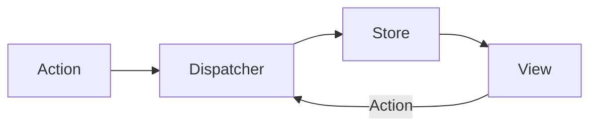

# Redux?
Redux란 React+Flux이다.
FLUX란 MVC처럼 하나의 패턴.
기존 MVC패턴의 불편함을 해소하기 위한 방책.

기존 MVC는 작은 애플리케이션에서는 문제가 없지만
Model과 View가 늘어나면 복잡해지는 단점이 있다.

## FLUX

Action이 발생되면 Dispatcher가 받고 받은 Ation들을 제어해서 Store에 있는 데이터를 업데이트 합니다. 이때 변동된 데이터가 있다면 View에 리렌더링(Re-Rendering)하는 패턴입니다.
View에서 Dispatcher로 Action을 보낼 수 있습니다.
Dispatcher는 어떤 Action이 Store에 있는 데이터를 처리하고 완료할때까지 다른 Action을 대기시켜 작업이 중첩되지 않도록 해줍니다.

이러한 특성으로 단방향이라는 특징이 있죠?

## Redux
앞에서 배운 FLUX는 패턴이라고 했습니다. Redux는 Flux를 좀더 쉽게 쓰기 위한 라이브러리입니다.

React에서 각 컴포넌트는 Store로 Dispath를 통해 데이터를 업데이트하고 Subscribe는 해당 컴포넌트가 Store에 있는 특정 데이터의 변화를 감지하고 이를 반영시키는것을 의미합니다.

### Redux 3원칙
1. Single Source of Truth
Redux는 State들을 한개의 store에 저장하고 있습니다. (Flux는 여러개의 Store를 사용합니다.) 전체 응용 프로그램의 상태는 단일 저장소 내의 오브젝트 트리에 저장됩니다.
따라서 서버의 상태를 별도의 코딩 작업없이 클라이언트에 직렬화(serialized)하고 수화(hydrated)할 수 있으므로 보편적인 응용 프로그램을 쉽게 만들 수 있습니다.
싱글 state 트리는 디버그나 점검하기 쉽게 만들어 줍니다. 또한 앱의 상태를 계속해서 개발환경으로 유지시킬 수 있으며 이는 개발이 빨라지게 됩니다.
모든 state가 단일 트리에 저장되어있다면 기존에 구현하기 어려운 일부 기능(실행취소, 다시 실행)이 갑자기 구현될 수 있습니다.
2. State is read-only
State를 변경하는 방법은 Action 객체를 전달하는 방법외에는 없습니다. 즉, 직접적으로 변경할 수는 없다는 것이죠.
이렇게 하면 뷰 또는 네트워크 콜백이 직접 state를 작성할 수 없습니다. 대신, 그들은 state를 변화시킬 의도를 표현합니다. 모든 변경 사항은 중앙 집중식으로 엄격한 순서로 하나씩 발생하기 때문에 조심해야할 미묘한 경쟁이 없습니다. Action은 단순한 객체이므로 디버깅 또는 테스트 목적으로 기록, 직렬화, 저장 및 나중에 재생할 수 있습니다.
3. Change are made with Pure Functions
Action 객체를 처리하는 함수는 Reducer라고 부르며 action은 어떤 변화인지를 알려주는 객체이고 Reducer는 그 정보를 적용하는 방법을 정의하는 것이라고 생각하면 될 것 같습니다.
여기서 Pure Function은 순수 함수로 전달 받은 Parameter를 변경하지 않고 이용하여 return해주는 함수를 의미합니다.

Reducer는 단지 이전 state와 action을 가지고고 다음 state를 반환하는 퓨어 함수입니다. 이전 state를 변경하는 것이 아닌 새로운 state오브젝트를 반환하는 것을 명심해야합니다. 단일 reducer로 시작할 수 있습니다. 그 뒤 app이 성작하면 그것을 state 트리으 ㅣ일정 부분을 관리하는 작은 reducer로 나눕니다. reducer는 단지 함수이기에 그들을 불러올 순서를 제어하거나, 추가적인 데이터를 전달하거나, 페이지 매김과 같이 일반적인 작업을 위해 재사용 가능한 reducer를 만들 수도 있습니다.
이것이 Redux에 대한 모든 내용입니다.
