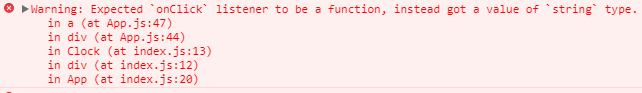

## Rendering Elements
브라우저의 DOM 엘러먼트(Elements)와 달리 React 엘러먼트는 분명한 객체이고 생성하는 비용이 저렴하다.
React DOM은 해당하는 엘러먼트의 변경만 신경씁니다.

## React화면을 주기적으로 갱신해보자

```jsx
function tick() {
  const element = (
    <div>
      <h1>Hello, world!</h1>
      <h2>It is {new Date().toLocaleTimeString()}.</h2>
    </div>
  );
  ReactDOM.render(element, document.getElementById('test'));
}

setInterval(tick, 1000);
```

index.html 파일안에 해당 내용을 작성한다.
tick이라는 함수를 만드는데 element로 div내용이 존재하는 함수다.
html로 h2 테그에 보면 {}안에 함수가 들어있는데 화면이 출력될때 시간을 보여준다.
그리고 reactDOM.render()가 element를 'test'라는 id를 가지는 html element에 렌더링시킨다.

setInterval()함수는 tick함수를 매1초마다 rerendering 한다.
이게 React의 면모를 보여주는 것은 아닐까 싶다.
보면 UI 화면의 한 부분을 작성하고 그것을 ID와 연결시켜 출력하라는 명령어 한줄이면
화면에 자동으로 출력이 된다.ㅣ


```jsx
function Comment(props) {
  return (
    <div className="Comment">
      <UserInfo user={props.author} />
      <div className="Comment-text">
        {props.text}
      </div>
      <div className="Comment-date">
        {formatDate(props.date)}
      </div>
    </div>
  );
}
```

```jsx
function Comment(props) {
  return (
    <div className="Comment">
      <div className="UserInfo">
        
        <div className="UserInfo-name">
          {props.author.name}
        </div>
      </div>
      <div className="Comment-text">
        {props.text}
      </div>
      <div className="Comment-date">
        {formatDate(props.date)}
      </div>
    </div>
  );
}
```
            
